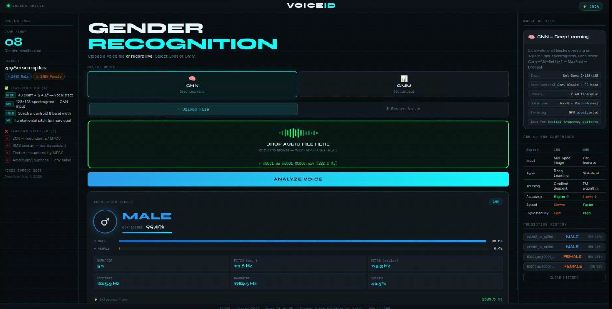

# 🎙️ VoiceID — Voice Gender Classification System


VoiceID is an intelligent **voice gender recognition web application** that predicts whether a speaker is **Male** or **Female** from an uploaded audio file.
The system combines **two different approaches** to improve prediction quality:

* **Deep Learning Approach** → CNN 
* **Statistical Machine Learning Approach** → Gaussian Mixture Model (GMM)

---

## 📌 Project Overview

This project analyzes speech signals and extracts meaningful audio features such as:

* MFCCs
* Pitch (Fundamental Frequency)
* Zero Crossing Rate
* RMS Energy

These features are then processed through multiple trained models to generate accurate gender classification results.

---

## 🧠 Methods Used

### 1. Deep Learning

Used for learning complex voice patterns directly from speech representations.

* **CNN (Convolutional Neural Network)**

### 2. Statistical Machine Learning

Used as a lightweight probabilistic baseline model.

* **Gaussian Mixture Model (GMM)**

---

## 📂 Project Structure

```bash
project/
├── Gender_Classification_Notebook.ipynb
├── flask_app/
│   ├── app.py
│   ├── templates/
│   ├── static/
│   └── models/
```

---

## 🚀 How to Run

### Install dependencies

```bash
pip install -r requirements.txt
```

### Start the application

```bash
python app.py
```

Then open:

```bash
http://localhost:5000
```

---

## 🖼️ Website Screenshots

### Homepage


---

## 📈 Sample Outputs

### Output Example 1


### Output Example 2



---

## 📁 Project Files

The following materials are available in the shared Google Drive folder:

* 📽️ Project Demo Video
* 📑 Presentation Slides
* 📝 Final Report

🔗 **Google Drive Link:**
(https://drive.google.com/drive/folders/17-PLi7FDGFu-2BB9vVHCPM39mCqzbIdh?usp=sharing)
---

## 👨‍💻 Team Members

This project was developed by:

* Mahmoud Saeed
* Nabil Amir
* Mina Saher
* Mohammed Maher
* Amr Saeed
* Ahmed Khaled
* Abdelrahman Mohammed
* Youssef Magdy
* Belal Amin
* Mohammed Walid
* Salah Eldin Mostafa

---

## 📜 License

This project is for academic purposes only.
